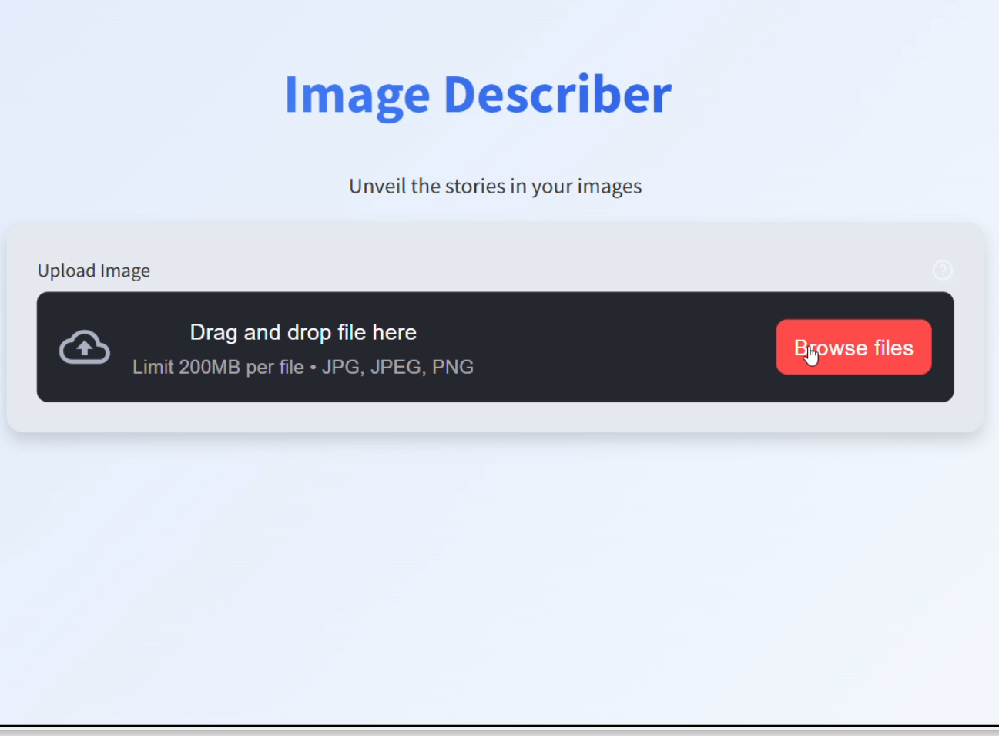
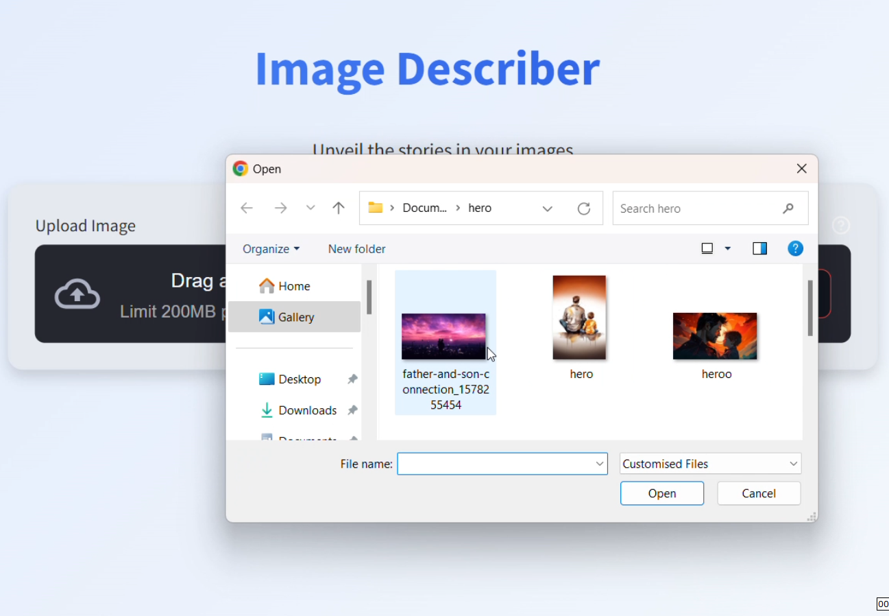
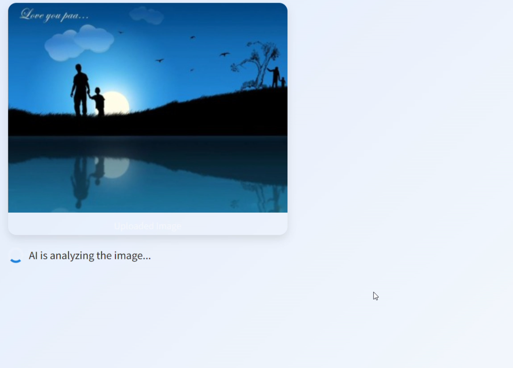
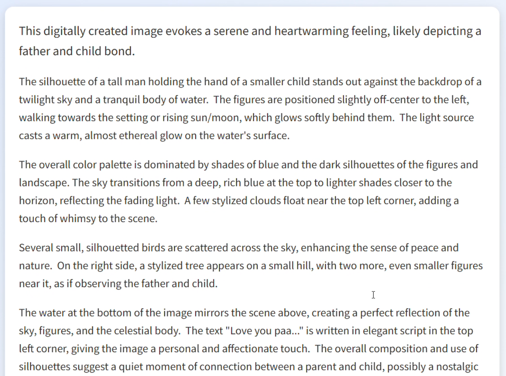

# Image-Describer: Multimodal AI Image Description Generator

## Project Overview
Image-Describer is an advanced multimodal AI application that generates detailed, context-aware descriptions for uploaded images using cutting-edge language and computer vision models.

## Technology Stack
- Computer Vision
- Advanced Language Models
- Multi-modal AI Integration
- Image Recognition Algorithms

## 🎥 Demo  
Here’s how the app looks in action:  

<div style="display: flex; gap: 10px;">
  
  
  
  
  
</div>


## Features
- Detailed image description generation
- Context-aware analysis
- Support for various image types
- Multilingual description capabilities

## Technical Components
- Image Feature Extraction
- Semantic Understanding
- Natural Language Generation
- Contextual Analysis

## Installation
```bash
git clone https://github.com/RakeshTirlangi/Image-Describer.git
cd Image-Describer
pip install -r requirements.txt
```

## Project Goals
- Bridge visual and textual understanding
- Enhance accessibility of visual content
- Provide rich, meaningful image descriptions
